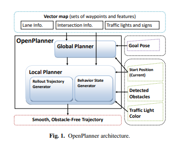
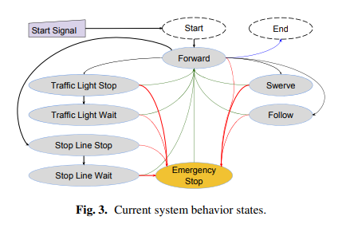
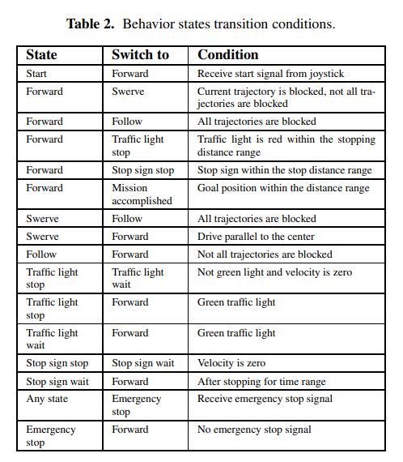
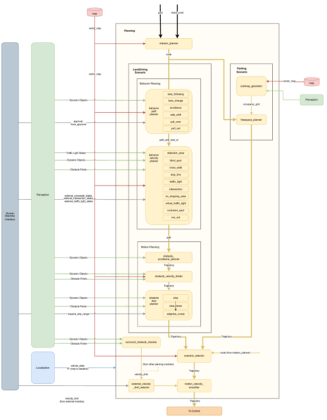
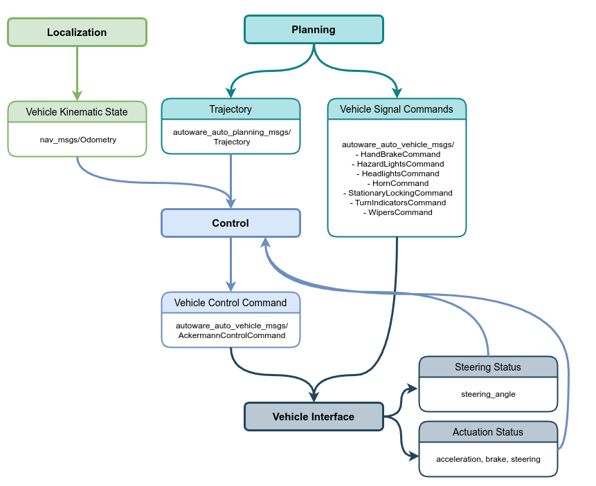

## 决策
1、[OpenPlanner](https://www.jstage.jst.go.jp/article/jrobomech/29/4/29_668/_pdf/-char/ja)：全局规划+决策状态机+局部规划，是autoware官方的决策规划模块。
- open-planner的整体架构图  

- 有限状态机概览图  

- 有限状态机状态间切换条件  

2、autoware官方[设计文档](https://autowarefoundation.github.io/autoware-documentation/galactic/design/autoware-architecture/planning/#1-self-crossing-road-and-overlapped)。
- 决策详细架构图  
  
图片看不清，可参考下面的SVG图。
- autoware整体[详细架构图(SVG)](https://app.diagrams.net/?lightbox=1#Uhttps%3A%2F%2Fautowarefoundation.github.io%2Fautoware-documentation%2Fgalactic%2Fdesign%2Fautoware-architecture%2Fnode-diagram%2Foverall-node-diagram-autoware-universe.drawio.svg)

## 规划
1、全局规划，[MissionPlanner](https://autowarefoundation.github.io/autoware.universe/main/planning/mission_planner/)。论文中提到这里使用高精地图（路网）作为输入，规划出一条从起点到终点的路径。OpenPlanner论文中提到使用的是DP算法（Dynamic Programming）, 本质上是与A star类似的方法。  
2、局部规划。使用感知和决策的结果，计算可行驶区域，考虑运动学约束、速度约束等，输出一条平滑的轨迹（一系列的路径点，每个点包含速度，加速度，加加速度，位置，朝向等）。具体参考OpenPlanner论文和[总体的规划模块技术文档](https://autowarefoundation.github.io/autoware-documentation/galactic/design/autoware-architecture/planning/)。

## 控制
控制模块的输入是：规划模块的轨迹、自车位姿、自车速度和角速度、自车油门刹车转角；
输出是：纵向（速度，加速度，加加速度）和横向指令（角速度、角加速度）。最后给车辆线控底盘DBW(Drive By Wire)执行。
- 控制模块架构图

- 官方[设计文档](https://autowarefoundation.github.io/autoware-documentation/main/design/autoware-architecture/control/)
- 官方[API文档](https://autowarefoundation.github.io/autoware-documentation/galactic/design/autoware-interfaces/components/control/)
- [代码](https://github.com/autowarefoundation/autoware.universe/blob/galactic/control/trajectory_follower/design/trajectory_follower-design.md)细节文档。横向控制采用[MPC](https://github.com/autowarefoundation/autoware.universe/blob/galactic/control/trajectory_follower/design/mpc_lateral_controller-design.md)，纵向控制采用[PID](https://github.com/autowarefoundation/autoware.universe/blob/galactic/control/trajectory_follower/design/pid_longitudinal_controller-design.md)

1、车辆运动学模型在控制中的应用  
[数学模型](https://www.ri.cmu.edu/pub_files/2009/2/Automatic_Steering_Methods_for_Autonomous_Automobile_Path_Tracking.pdf)，参考CMU教材第18页。  
2、车辆动力学模型在控制中的应用  
[数学模型](https://www.ri.cmu.edu/pub_files/2009/2/Automatic_Steering_Methods_for_Autonomous_Automobile_Path_Tracking.pdf)，参考CMU教材第28页。  

备注：以上两种数学模型仅用于横向MPC控制。